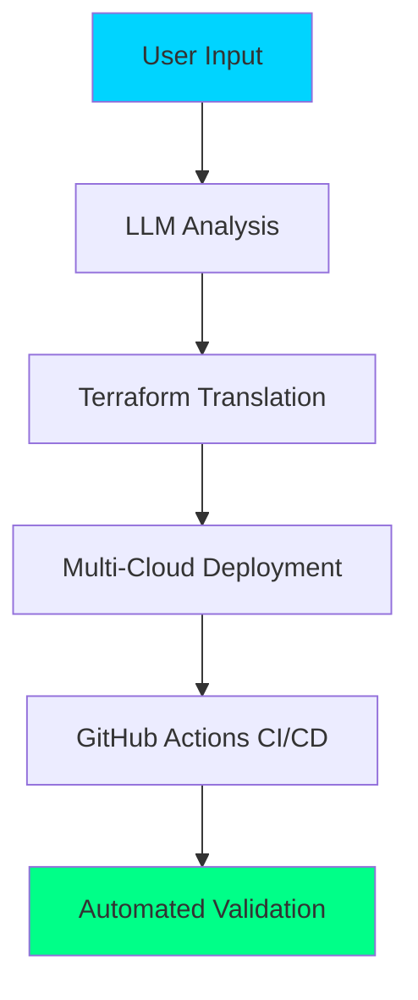
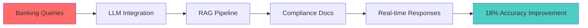
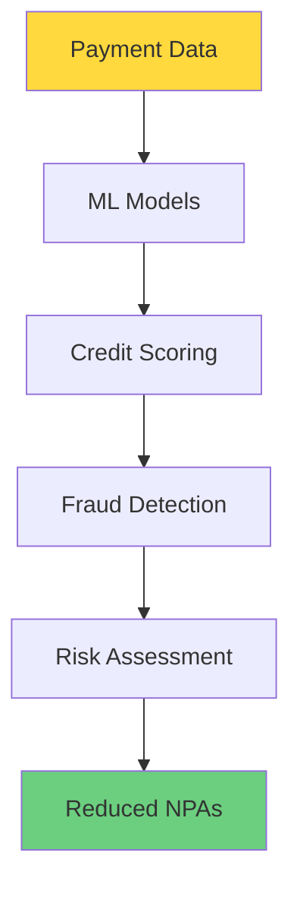
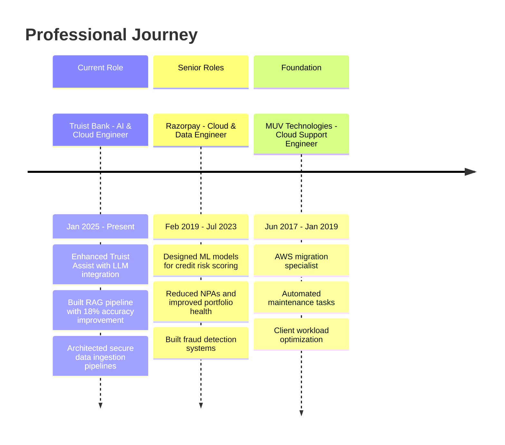

<div align="center">

# 🚀 Raviteja Annam
### AI & Cloud Engineer | Generative AI Specialist | Cloud Architect

[](https://git.io/typing-svg)


</div>

---

<div align="center">

## 🌟 About Me


```python
class RavitejaAnnam:
    def __init__(self):
        self.name = "Raviteja Annam"
        self.role = "AI & Cloud Engineer"
        self.location = "Charlotte, NC, USA"
        self.education = "M.Sc. Computer Science (AI/ML) - Oklahoma City University"
        self.gpa = "3.9/4.0"
        self.experience = "7+ years in Cloud, AI/ML, and Data Engineering"
        
    def current_focus(self):
        return [
            "Generative AI & LLM Integration",
            "Cloud-Native AI Solutions", 
            "Retrieval-Augmented Generation (RAG)",
            "Multi-Cloud Architecture",
            "AI-Powered Automation"
        ]
        
    def passion(self):
        return "Bridging cloud, automation, and GenAI to deliver measurable business impact"
        
    def fun_fact(self):
        return "Enhanced Truist Assist with 18% improvement in first-response accuracy"
```

</div>

---

<div align="center">

## 📞 Connect With Me

[](https://linkedin.com/in/ravitejas1596)
[](https://github.com/Ravitejas1596)
[](mailto:ravitejas1596@gmail.com)
[](tel:+14054029977)

</div>

---

<div align="center">

## 🛠️ Tech Stack & Skills

### ☁️ Cloud Technologies


### 🤖 AI/ML & Generative AI


### 💾 Data Engineering


### 🐳 DevOps & Automation


### 🔧 Programming & Frameworks


</div>

---

<div align="center">

## 🚀 Featured Projects

### 🎯 Cross-Cloud LLM-Powered Cloud Migration Assistant
[](#)



**Key Features:**
- 🤖 **Generative AI Assistant** - Translates application code & IaC across AWS, Azure, and GCP
- 🔄 **50% Reduction** in manual migration effort
- 🧠 **RAG Pipeline** with embedded Terraform configs and fine-tuned LLMs
- ⚡ **Auto-Generated CI/CD** pipelines with GitHub Actions
- 🔧 **Seamless Multi-Cloud** workload provisioning

**Tech Stack:** `AWS` `Azure` `GCP` `Terraform` `GitHub Actions` `Python` `LangChain` `HuggingFace` `Docker`

---

### 🏦 Truist Assist - Enterprise AI Enhancement
[](#)



**Achievements:**
- 📈 **18% Improvement** in first-response accuracy
- 🔍 **RAG Pipeline** with LangChain + Pinecone integration
- 📋 **Real-time Compliance** document indexing
- 📊 **CloudWatch Monitoring** for latency and hallucination metrics
- 🏛️ **Enterprise-Grade** security and governance

**Tech Stack:** `Azure OpenAI` `AWS` `Pinecone` `LangChain` `HuggingFace` `Python` `Docker` `FastAPI`

---

### 💳 Razorpay - AI-Powered Financial Solutions
[](#)



**Impact:**
- 💰 **Reduced NPAs** and improved portfolio health
- 🛡️ **Significant Reduction** in chargeback losses
- ⚡ **25% Improvement** in response times during peak loads
- 📊 **Real-time Transaction** scoring with SageMaker
- 🔄 **Blue-Green Deployments** with zero downtime

**Tech Stack:** `AWS` `SageMaker` `Redshift` `Terraform` `Python` `Docker` `Jenkins` `QuickSight`

</div>

---

<div align="center">

## 📊 GitHub Analytics


</div>

---

<div align="center">

## 🎯 Advanced Project Portfolio

<details>
<summary><b>🤖 Generative AI Projects</b></summary>

### Agentic AI for Real-Time Regulatory Monitoring
- **RAG-powered** live regulation tracking
- **Slack/Teams** bot integration for alerts
- **Auto-generated** compliance documentation
- **Jira/ServiceNow** ticket automation

### Cloud-Native Generative Threat Simulator
- **Weekly RAG** training on cybersecurity data
- **PagerDuty** integration for incident response
- **SIEM** integration with vulnerability scanners
- **Auto-updating** security playbooks

### Personalized Multimodal Healthcare AI Assistant
- **HIPAA-compliant** patient dashboards
- **X-ray/NLP/Speech** multimodal processing
- **EHR** system integration
- **Real-time** risk assessment alerts

</details>

<details>
<summary><b>☁️ Cloud Infrastructure Projects</b></summary>

### Cross-Cloud AI Data Governance Platform
- **Real-time** compliance data integration
- **Slack API** live alerts and notifications
- **Terraform/Pulumi** automated remediation
- **Streamlit/Grafana** interactive dashboards

### Autonomous Cloud Cost Optimizer
- **Auto-execution** of cost savings with approval workflows
- **Slack/Teams** integration for notifications
- **Jira/ServiceNow** documentation automation
- **RAG** on cost-reduction innovations

### Zero-Shot Multi-Cloud Migration Assistant
- **Plain English** migration descriptions
- **Real-time** IaC code adaptation
- **Automated** canary validation and rollback
- **CI/CD** tool integration (GitHub Actions, Jenkins)

</details>

<details>
<summary><b>🔧 DevOps & Automation Projects</b></summary>

### AI-Powered Data Pipeline Quality Auditor
- **RAG-capable** ETL issue learning
- **PagerDuty/Slack** automatic triggers
- **GitHub Issues** integration
- **Root-cause** analysis with GenAI

### Cloud Usage Heatmap & Sustainability AI
- **Global carbon footprint** API integration
- **Green scheduling** recommendations
- **Zapier/API** cloud resource automation
- **Sustainability** compliance reporting

### Self-Learning AI Code Reviewer
- **GitHub/GitLab** API integration
- **Real-time** security checks and reviews
- **Slack** escalation for high-severity findings
- **Team coding style** adaptation over time

</details>

</div>

---

<div align="center">

## 🏆 Professional Experience Timeline



</div>

---

<div align="center">

## 🎓 Education & Certifications


### 📚 Coursework
- **Machine Learning & Deep Learning**
- **Generative AI & NLP**
- **Cloud Computing & Distributed Systems**
- **Data Engineering & Analytics**

</div>

---

<div align="center">

## 🌟 Key Achievements

<div align="center">
  
| 🏆 Achievement | 📊 Impact | 🚀 Technology |
|:---:|:---:|:---:|
| **Truist Assist Enhancement** | 18% accuracy improvement | Azure OpenAI + LangChain |
| **Cross-Cloud Migration** | 50% effort reduction | Multi-Cloud + LLM |
| **Fraud Detection** | Significant chargeback reduction | SageMaker + ML |
| **Performance Optimization** | 25% response time improvement | AWS + Auto-scaling |
| **Cost Optimization** | Measurable infrastructure savings | Terraform + Automation |

</div>

</div>

---

<div align="center">

## 🎯 What I'm Currently Working On

- 🔥 **Advanced RAG Systems** - Building next-generation retrieval-augmented generation pipelines
- 🤖 **Agentic AI** - Developing autonomous AI agents for enterprise automation
- ☁️ **Multi-Cloud AI** - Architecting cloud-agnostic AI/ML solutions
- 🔐 **AI Security** - Implementing secure AI systems for financial services
- 📊 **Real-time Analytics** - Building streaming data pipelines with AI insights

</div>

---

<div align="center">

## 🚀 Let's Build Something Amazing Together!

[](https://github.com/Ravitejas1596)
[](https://linkedin.com/in/ravitejas1596)
[](mailto:ravitejas1596@gmail.com)


### 💡 "Bridging cloud, automation, and GenAI to deliver measurable business impact"

---

<div align="center">
  


</div>

</div>
