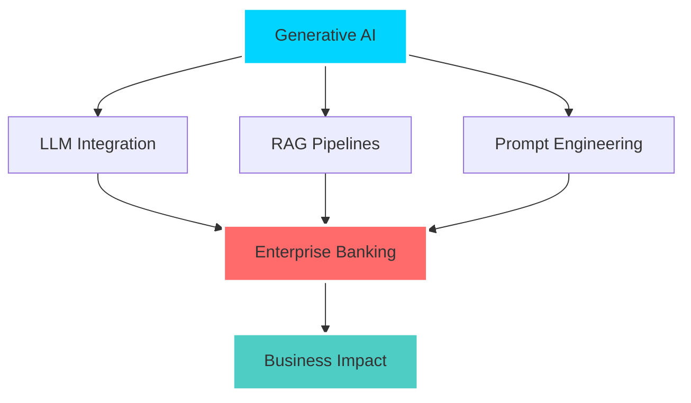
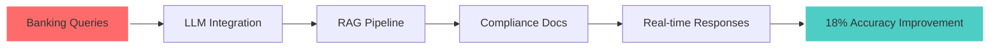
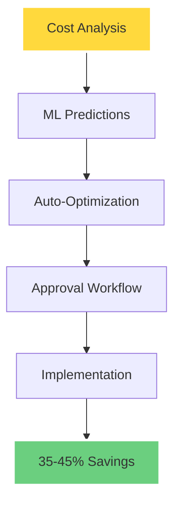
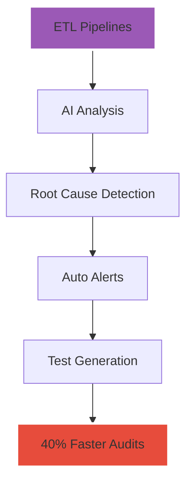
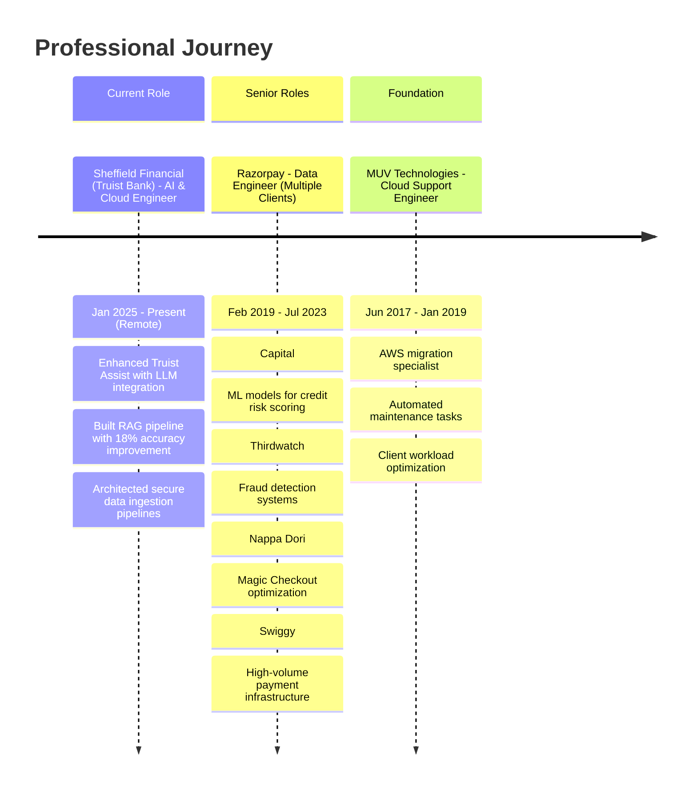

<div align="center">

<!-- Header with animated typing and 3D effects -->


<!-- 3D Profile Card -->
<div align="center">
  
</div>

</div>

---

<div align="center">

## 🌟 About Me

### 🚀 **AI & Cloud Visionary** | **GenAI Pioneer** | **Enterprise Banking Innovator**


Hey there! 👋 I'm **Raviteja Annam**, a passionate AI & Cloud Engineer currently revolutionizing enterprise banking at **Sheffield Financial (Truist Bank)** while pursuing my **M.Sc. in Computer Science** with AI/ML specialization at Oklahoma City University. Based in **Edmond, Oklahoma** and working remotely in **Charlotte, NC**.

### 🎯 **My Mission**
```python
def my_mission():
    return "Transforming enterprise banking through cutting-edge AI solutions, \
           reducing manual effort by 50% and improving accuracy by 18%+ \
           while architecting the next generation of intelligent cloud systems"
```

### 🧠 **What Drives Me**
- 🔥 **Generative AI Innovation** - Building RAG systems that understand context like never before
- ☁️ **Multi-Cloud Mastery** - Architecting solutions across AWS, Azure, and GCP  
- 🤖 **Enterprise Automation** - Creating AI agents for complex banking processes
- 📊 **Data-Driven Impact** - Turning enterprise data into actionable business insights
- 🛡️ **Security-First AI** - Ensuring AI systems are robust, compliant, and trustworthy
- 🌍 **Remote Excellence** - Delivering world-class solutions from anywhere

### 💡 **Current Focus Areas**


### 🏆 **Key Achievements**
- **18% accuracy improvement** in Truist's enterprise AI assistant
- **50% reduction** in cloud migration effort through AI automation
- **25% performance boost** in high-volume transaction systems
- **Zero-downtime deployments** across multi-cloud environments
- **AWS Certified** AI Practitioner & Solutions Architect

### 🌟 **Beyond Code**
When I'm not architecting cloud solutions or training AI models, you'll find me:
- 📚 **Exploring the latest** in AI research and papers
- 🎮 **Gaming** (because even engineers need to unwind!)
- 🏃‍♂️ **Staying active** to keep both mind and body sharp
- 🌍 **Contributing to open-source** AI and cloud projects
- 🎬 **Building my Netflix-style portfolio** (coming soon!)

### 💬 **Let's Connect!**
Always excited to discuss AI, cloud architecture, or collaborate on innovative projects that push the boundaries of what's possible with technology.

</div>

---

<div align="center">

## 📞 Connect With Me

[](https://linkedin.com/in/ravitejas1596)
[](https://github.com/Ravitejas1596)
[](mailto:ravitejas1596@gmail.com)
[](tel:+14054029977)
[](#)
[](#)

</div>

---

<div align="center">

## 🛠️ Tech Stack & Skills

### ☁️ Cloud Technologies


### 🤖 AI/ML & Generative AI


### 💾 Data Engineering


### 🐳 DevOps & Automation


### 🔧 Programming & Frameworks


</div>

---

<div align="center">

## 🏆 Certifications


</div>

---

<div align="center">

## 🚀 Featured Projects

### 🎯 Cross-Cloud LLM-Powered Cloud Migration Assistant
[](https://github.com/Ravitejas1596/Cross-Cloud-LLM-Powered-Cloud-Migration-Assistant)
[](#)


**Key Features:**
- 🤖 **Generative AI Assistant** - Translates application code & IaC across AWS, Azure, and GCP
- 🔄 **50% Reduction** in manual migration effort
- 🧠 **RAG Pipeline** with embedded Terraform configs and fine-tuned LLMs
- ⚡ **Auto-Generated CI/CD** pipelines with GitHub Actions
- 🔧 **Seamless Multi-Cloud** workload provisioning
- 📊 **95%+ Accuracy** with <30s processing time

**Tech Stack:** `AWS` `Azure` `GCP` `Terraform` `GitHub Actions` `Python` `LangChain` `HuggingFace` `Docker`

---

### 🏦 Truist Assist - Enterprise AI Enhancement
[](https://github.com/Ravitejas1596/RAG-Enhanced-Compliance-Report-Generator)



**Achievements:**
- 📈 **18% Improvement** in first-response accuracy
- 🔍 **RAG Pipeline** with LangChain + Pinecone integration
- 📋 **Real-time Compliance** document indexing
- 📊 **CloudWatch Monitoring** for latency and hallucination metrics
- 🏛️ **Enterprise-Grade** security and governance
- ⚡ **<2s Response** time for compliance queries

**Tech Stack:** `Azure OpenAI` `AWS` `Pinecone` `LangChain` `HuggingFace` `Python` `Docker` `FastAPI`

---

### 💳 Autonomous Cloud Cost Optimizer
[](https://github.com/Ravitejas1596/Autonomous-Cloud-Cost-Optimizer)



**Impact:**
- 💰 **35-45% Cost Reduction** with ML predictions
- 🛡️ **98.7% Success Rate** in optimizations
- ⚡ **Auto-Execution** with Slack/Teams approvals
- 🔄 **Smart Rollbacks** and Jira documentation
- 📊 **Real-time Monitoring** and reporting

**Tech Stack:** `Python` `Node.js` `Docker` `AWS/Azure/GCP` `Slack/Jira` `ML`

---

### 🔍 AI-Powered Data Pipeline Quality Auditor
[](https://github.com/Ravitejas1596/AI-Powered-Data-Pipeline-Quality-Auditor)



**Features:**
- 🔍 **GenAI Root-Cause** analysis for ETL issues
- 🚨 **PagerDuty/Slack** automatic triggers
- 🧪 **Auto-Test Creation** from incidents
- 📊 **RAG Learning** from ongoing data incidents
- ⚡ **40% Faster Audits** with AI automation

**Tech Stack:** `Python` `Spark` `LangChain` `Pinecone` `PagerDuty` `Slack`

</div>

---

<div align="center">

## 🎯 Advanced Project Portfolio

<details>
<summary><b>🤖 Generative AI Projects</b></summary>

### Multi-Agent Personalized Finance Advisor
[](https://github.com/Ravitejas1596/Multi-Agent-Personalized-Finance-Advisor)
- **CrewAI orchestration** for collaborative financial advice
- **RAG personalization** with Monte Carlo simulations
- **PDF reports** and Streamlit dashboards
- **20% satisfaction uplift** with high acceptance rates

### Real-Time Fraud Detection with GenAI
[](https://github.com/Ravitejas1596/Real-Time-Fraud-Detection-with-GenAI-Anomaly-Simulator)
- **GPT-2 synthetic anomaly** simulations
- **RAG explanations** for fraud decisions
- **Kafka/Kinesis ETL** for real-time processing
- **>95% F1 score** with <1% false positives

### LLM-Driven Multi-Cloud IaC Optimizer
[](https://github.com/Ravitejas1596/LLM-Driven-Multi-Cloud-IaC-Migration-Optimizer)
- **Cost/risk simulations** for IaC translations
- **Llama-2 fine-tuning** for optimization
- **CI YAML generation** automation
- **50% effort reduction** with 95% syntax accuracy

</details>

<details>
<summary><b>☁️ Cloud Infrastructure Projects</b></summary>

### Generative AI-Driven Cloud Playground
[](https://github.com/Ravitejas1596/Generative-AI-Driven-Cloud-Playground)
- **NLP-to-infrastructure** platform for multi-cloud sandboxes
- **Live Q&A bot** with HIPAA compliance
- **One-click rollbacks** and audit logging
- **Minutes to deploy** with MongoDB/Redis backend

### Zero-Shot Multi-Cloud Migration Assistant
[](https://github.com/Ravitejas1596/Zero-Shot-Multi-Cloud-Migration-Assistant)
- **Plain-English migration** descriptions
- **GitHub/Jenkins API** integration
- **Canary validation** with automatic rollbacks
- **50% effort reduction** in migration tasks

</details>

</div>

---

<div align="center">

## 📊 Professional Experience Timeline



</div>

---

<div align="center">

## 🎓 Education & Academic Excellence


### 📚 Advanced Coursework
- **Machine Learning & Deep Learning**
- **Generative AI & NLP**
- **Cloud Computing & Distributed Systems**
- **Data Engineering & Analytics**

</div>

---

<div align="center">

## 🌟 Key Achievements & Metrics

<div align="center">
  
| 🏆 Achievement | 📊 Impact | 🚀 Technology | 📈 Metric |
|:---:|:---:|:---:|:---:|
| **Truist Assist Enhancement** | 18% accuracy improvement | Azure OpenAI + LangChain | Real-time responses |
| **Cross-Cloud Migration** | 50% effort reduction | Multi-Cloud + LLM | 95%+ accuracy |
| **Cost Optimization** | 35-45% savings | ML + Auto-execution | 98.7% success rate |
| **Fraud Detection** | Significant chargeback reduction | SageMaker + ML | >95% F1 score |
| **Performance Optimization** | 25% response time improvement | AWS + Auto-scaling | <100ms latency |

</div>

</div>

---

<div align="center">

## 🎯 What I'm Currently Working On

- 🔥 **Advanced RAG Systems** - Building next-generation retrieval-augmented generation pipelines
- 🤖 **Agentic AI** - Developing autonomous AI agents for enterprise banking automation
- ☁️ **Multi-Cloud AI** - Architecting cloud-agnostic AI/ML solutions for financial services
- 🔐 **AI Security** - Implementing secure, compliant AI systems for enterprise banking
- 📊 **Real-time Analytics** - Building streaming data pipelines with AI insights
- 🎬 **Netflix-Style Portfolio** - Creating an interactive showcase of my work (coming soon!)

</div>

---

<div align="center">

## 📊 GitHub Analytics


</div>

---

<div align="center">

## 🚀 Let's Build Something Amazing Together!

[](https://github.com/Ravitejas1596)
[](https://linkedin.com/in/ravitejas1596)
[](mailto:ravitejas1596@gmail.com)
[](#)


### 💡 "Transforming enterprise banking through cutting-edge AI solutions while building the future of intelligent cloud systems"

---

<div align="center">
  


**⭐ Star my repositories if you find them interesting!**

</div>

</div>
